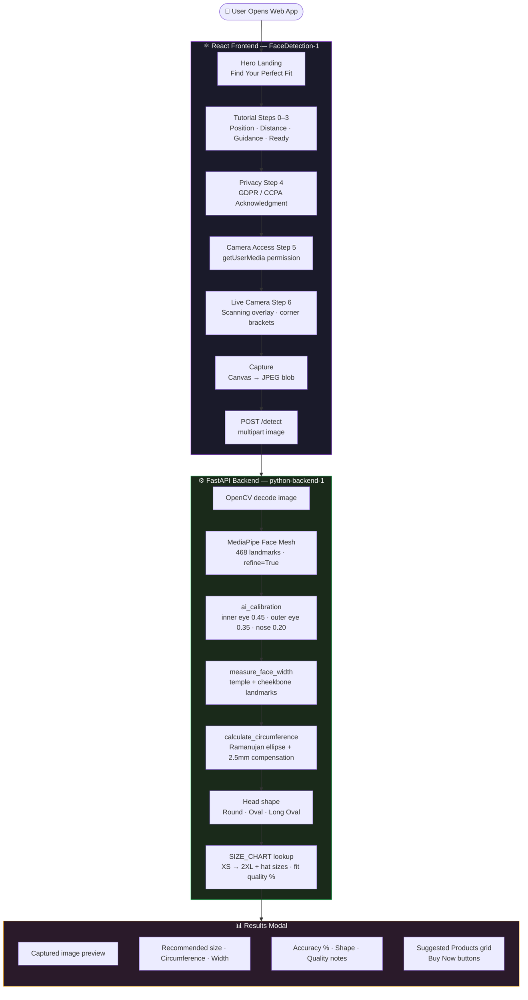

<!-- ████████████████████████████████  HEADER  ████████████████████████████████ -->

<div align="center">


</div>

<!-- ████████████████████████████████  TYPING  ████████████████████████████████ -->

<div align="center">

[](https://git.io/typing-svg)

</div>

<br/>

<!-- ████████████████████████████████  BADGES  ████████████████████████████████ -->

<div align="center">

[](https://react.dev)
[](https://vitejs.dev)
[](https://fastapi.tiangolo.com)
[](https://mediapipe.dev)
[](https://tailwindcss.com)
[](.)
[](.)

</div>

<br/>

---

<!-- ████████████████████████████████  ABOUT  ████████████████████████████████ -->

## 🧠 What This Project Does

```python
class HelmetSense:
    def __init__(self):
        self.purpose    = "AI helmet/hat sizing — no measuring tape, no reference object"
        self.input      = "Single front-facing photo via browser webcam"
        self.output     = "Head circumference · width · depth · shape · recommended size"
        self.standard   = "ISO 7250-1:2017 (International anthropometric standards)"
        self.deployment = "Shopify-integrable — 'Find Your Perfect Fit' before checkout"

    @property
    def measurement_pipeline(self):
        return {
            "calibration"    : "3 facial rulers (inner eye, outer eye, nose width) → px/mm scale",
            "face_width"     : "Temple + cheekbone landmarks (MediaPipe 234/127, 454/356)",
            "circumference"  : "Ramanujan ellipse approx + 2.5mm hair compensation → 51–65cm",
            "shape"          : "width/depth ratio → Round / Oval / Long Oval",
            "size_lookup"    : "X-Small to 2X-Large + hat sizes · fit quality %",
        }

    def detect(self, image: bytes) -> dict:
        # POST /detect → multipart image → full measurement + size recommendation
        return {
            "measurements"       : {...},
            "size_recommendation": {...},
            "confidence"         : float,
            "quality_notes"      : [...],
        }
```

> Upload a photo — get your helmet size. No measuring tape. No calibration object. Just **468 MediaPipe face landmarks** mapped to ISO anthropometric standards.

---

<!-- ████████████████████████████████  PIPELINE  ████████████████████████████████ -->

## 🔁 End-to-End Pipeline



---

<!-- ████████████████████████████████  MEASUREMENT  ████████████████████████████████ -->

## 📐 How the Measurement Works

### Step 1 — Calibration (no reference object)

Three facial landmarks used as known-distance rulers to compute a **weighted pixels-per-mm scale**:

<div align="center">

| Facial Feature | Known Distance | Weight |
|:---|:---:|:---:|
| Inner-eye distance | 31.5 mm | 0.45 |
| Outer-eye distance | 93 mm | 0.35 |
| Nose width | 35 mm | 0.20 |

</div>

### Step 2 — Face Width
Averages **temple + cheekbone landmarks** (MediaPipe indices `234`/`127` left · `454`/`356` right) → `measure_face_width()`

### Step 3 — Head Circumference
```
full_head_width  = face_width ÷ 0.93
depth            = full_head_width × 1.28
circumference    = Ramanujan ellipse approximation
                 + 2.5 mm hair/skin compensation
                 clamped to 51–65 cm
```

### Step 4 — Size Lookup

<div align="center">

| Size | Circumference Range | Hat Size |
|:---:|:---:|:---:|
| X-Small | 51–53 cm | 6⅜ – 6⅝ |
| Small | 53–55 cm | 6⅝ – 6⅞ |
| Medium | 55–57 cm | 6⅞ – 7⅛ |
| Large | 57–59 cm | 7⅛ – 7⅜ |
| X-Large | 59–61 cm | 7⅜ – 7⅝ |
| 2X-Large | 61–65 cm | 7⅝ – 8⅛ |

</div>

### Step 5 — Head Shape
```
ratio = width / depth
Round     → ratio ≥ 0.85
Oval      → 0.75 ≤ ratio < 0.85
Long Oval → ratio < 0.75
```

> Reference standard: **ISO 7250-1:2017** — Body measurements of the head and face for industrial design.

---

<!-- ████████████████████████████████  API  ████████████████████████████████ -->

## 🔗 API Endpoints

<div align="center">

| Method | Endpoint | Description |
|:---:|:---|:---|
| `GET` | `/` | Health check |
| `GET` | `/size-chart` | Returns full helmet size chart JSON |
| `POST` | `/detect` | Multipart image upload → full measurement result |

</div>

**POST `/detect` Response:**

```json
{
  "measurements": {
    "circumference_cm": 57.3,
    "face_width_mm": 142.5,
    "head_depth_mm": 196.8,
    "head_shape": "Oval"
  },
  "size_recommendation": {
    "recommended_size": "Medium",
    "hat_size": "7⅛ – 7⅜",
    "fit_quality": "Excellent",
    "accuracy_percent": 94.2
  },
  "confidence": 0.94,
  "quality_notes": [],
  "calibration_info": {...}
}
```

---

<!-- ████████████████████████████████  TECH  ████████████████████████████████ -->

## 🛠️ Tech Stack

<div align="center">

[](.)

### Frontend — `FaceDetection-1/`

| Library | Version | Role |
|:---|:---:|:---|
| React | 19.2 | UI framework |
| Vite + SWC | 7 | Build tool — fast HMR |
| Tailwind CSS | v4 | Styling |
| Browser MediaDevices API | — | Live webcam capture |
| `<canvas>` | — | Frame capture → JPEG blob |
| React.lazy + Suspense | — | Lazy-loaded hero UI |

### Backend — `python-backend-1/`

| Library | Role |
|:---|:---|
| FastAPI + Uvicorn | REST API server |
| OpenCV (`cv2`) | Image decoding |
| MediaPipe Face Mesh | 468 landmark detection · `refine_landmarks=True` |
| NumPy | Vector math for measurements |
| python-multipart | Multipart image upload parsing |

</div>

---

<!-- ████████████████████████████████  STRUCTURE  ████████████████████████████████ -->

## 🗂️ Repository Structure

```
HelmetSense/
├── FaceDetection-1/                    ← React + Vite frontend
│   ├── src/
│   │   ├── App.jsx                     ← Lazy-loads hero UI
│   │   ├── Images/                     ← Tutorial illustrations
│   │   ├── components/
│   │   │   ├── background/
│   │   │   │   └── globalBackground.jsx
│   │   │   └── hero-dasboard-ui/
│   │   │       ├── heroUi.jsx          ← Main UI: tutorial → privacy → camera → scan
│   │   │       ├── resultmodeluI.jsx   ← Results modal
│   │   │       └── service/apiService.js  ← POST /detect
│   │   └── pages/heroLogic.jsx         ← All hooks · state · camera · capture logic
│   ├── package.json
│   └── vite.config.js
│
└── python-backend-1/                   ← FastAPI + MediaPipe backend
    ├── app/
    │   ├── main.py                     ← HeadMeasurementSystem (line 992+)
    │   └── head_pose.py                ← Legacy HeadMeasurer (fully commented out)
    └── requirements.txt                ← ⚠️ Currently empty — see setup below
```

---

<!-- ████████████████████████████████  GETTING STARTED  ████████████████████████████████ -->

## 🚀 Getting Started

### 1️⃣ Backend Setup

```bash
cd python-backend-1

# requirements.txt is empty — install manually:
pip install fastapi uvicorn opencv-python mediapipe numpy python-multipart

python -m uvicorn app.main:app --reload --host 0.0.0.0 --port 8000
```

✅ Backend live at `http://localhost:8000`

### 2️⃣ Frontend Setup

```bash
cd FaceDetection-1

npm install
npm run dev        # Vite dev server → http://localhost:5173
```

✅ Open the Vite URL → **Start Face Scan** → walk through tutorial → allow camera → capture.

> The frontend posts to `http://localhost:8000/detect` — backend must be running first.

---

<!-- ████████████████████████████████  KNOWN ISSUES  ████████████████████████████████ -->

## ⚠️ Known Issues &amp; TODOs

<div align="center">

| Issue | Location | Fix |
|:---|:---|:---|
| `requirements.txt` is empty | `python-backend-1/requirements.txt` | Populate with all 5 dependencies |
| API response key mismatch | `heroLogic.jsx:269` | Map `size_recommendation.recommended_size` → `recommendedSize` |
| Hardcoded `localhost:8000` | `apiService.js:1` | Move to `.env` var before deploying |
| CORS open to `*` | `main.py` | Tighten to specific origins before prod |
| `head_pose.py` is dead code | `python-backend-1/app/head_pose.py` | Remove or archive |
| Typo in folder name | `hero-dasboard-ui/` | Rename to `hero-dashboard-ui/` (update all imports) |

</div>

---

<!-- ████████████████████████████████  ROADMAP  ████████████████████████████████ -->

## 📌 Roadmap

- [ ] Fix API response key mapping — results modal currently shows "N/A" for all fields
- [ ] Populate `requirements.txt`
- [ ] Move `API_BASE_URL` to environment variable
- [ ] Tighten CORS for production
- [ ] Live Shopify embed integration
- [ ] Multi-photo averaging for improved measurement accuracy
- [ ] Mobile camera support (rear-facing)

---

<!-- ████████████████████████████████  FOOTER  ████████████████████████████████ -->

<div align="center">


**Krishna Nagpal** · HelmetSense · AI-Powered Sizing

[](https://fastapi.tiangolo.com)
[](https://mediapipe.dev)
[](.)

> *"No measuring tape. No reference card. Just your face."*

⭐ Star this repo if it was useful!

</div>
