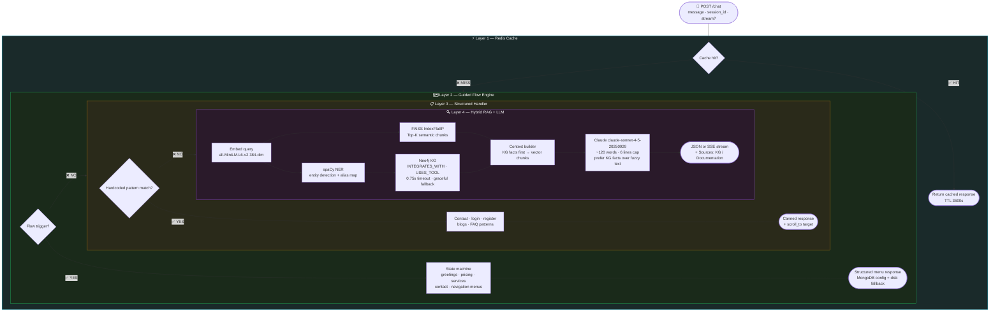

<!-- ████████████████████████████████  HEADER  ████████████████████████████████ -->

<div align="center">


</div>

<!-- ████████████████████████████████  TYPING  ████████████████████████████████ -->

<div align="center">

[](https://git.io/typing-svg)

</div>

<br/>

<!-- ████████████████████████████████  BADGES  ████████████████████████████████ -->

<div align="center">

[](https://fastapi.tiangolo.com)
[](https://anthropic.com)
[](https://faiss.ai)
[](https://neo4j.com)
[](https://redis.io)
[](https://mongodb.com)
[](https://spacy.io)

</div>

<br/>

---

<!-- ████████████████████████████████  ABOUT  ████████████████████████████████ -->

## 🧠 What This Project Does

```python
class TTTWebsiteChatbot:
    def __init__(self):
        self.author   = "Anisha Singla"
        self.purpose  = "Production hybrid AI chatbot for the Teeny Tech Trek website"
        self.core_idea = "Answer from the cheapest layer first — escalate to LLM only if needed"
        self.llm      = "Anthropic Claude (claude-sonnet-4-5-20250929)"
        self.layers   = ["Redis Cache", "Guided Flow Engine", "Structured Handler", "RAG + KG + Claude"]

    @property
    def pipeline(self):
        return "Request → Cache → Guided Flow → Structured Handler → RAG (FAISS + Neo4j) → Claude → Fallback"

    @property
    def why_four_layers(self):
        return {
            "cache"      : "Easy 80% — identical queries served in microseconds, no LLM cost",
            "flow"       : "Menu navigation, greetings, pricing — deterministic, always accurate",
            "structured" : "Contact / login / FAQ — canned responses, zero retrieval needed",
            "rag_kg_llm" : "Hard 20% — FAISS for context, Neo4j for facts, Claude for synthesis",
        }

    @property
    def why_two_stores(self):
        return {
            "neo4j" : "Precise for relationships — 'does X integrate with Y?' → atomic triplets",
            "faiss" : "Strong for explanations — long-form context and semantic similarity",
            "result": "Higher factual precision + better semantic coverage together",
        }
```

> Pure RAG hallucinates on relationship questions. Pure flow can't answer open questions. Pure KG can't explain anything. **Stacking all four** means the easy 80% of queries never hit Claude at all.

---

<!-- ████████████████████████████████  PIPELINE  ████████████████████████████████ -->

## 🔁 Decision Waterfall



---

<!-- ████████████████████████████████  HYBRID  ████████████████████████████████ -->

## 🔬 Hybrid Retrieval — Why Two Stores

<div align="center">

| Store | Strength | Use Case |
|:---|:---|:---|
| **Neo4j** (Knowledge Graph) | Precise atomic facts | *"Does X integrate with Y?"* → `INTEGRATES_WITH` predicate |
| **FAISS** (Vector Index) | Semantic similarity · long-form | Explanations · narratives · policy docs |

</div>

**How they combine:**

```
Query → spaCy NER + ENTITY_ALIASES → canonicalize ("slack" → "Slack")
      → Neo4j: atomic triplets (0.75s timeout, graceful fallback to vector-only)
      → FAISS: top-K semantic chunks
      → Context builder: KG facts FIRST, then vector chunks
      → Claude: instructed to prefer KG facts, avoid unsupported claims
```

> KG facts are placed **before** vector chunks in the prompt — so Claude is biased toward hard facts over fuzzy paragraphs.

---

<!-- ████████████████████████████████  EXAMPLE  ████████████████████████████████ -->

## 🧪 Real Query Trace — *"Does the chatbot integrate with Slack?"*

```
1. POST /chat → router → pipeline.run()
2. Cache miss
3. Not a flow trigger (not a greeting / pricing / menu)
4. Not a structured pattern (not contact / login / FAQ)
5. → RAG layer
6.   FAISS returns chunks about integrations
7.   spaCy finds entities: Chatbot, Slack
8.   Neo4j returns: Chatbot INTEGRATES_WITH Slack  (atomic fact)
9.   Context: [KG] Chatbot integrates with Slack → [Docs] integration narrative
10.  Claude prompted: "prefer KG facts, ~120 words, no unsupported claims"
11.  Response shaped: bullets + length cap + Sources: Knowledge Graph
12.  Returned as JSON or SSE stream
```

---

<!-- ████████████████████████████████  API  ████████████████████████████████ -->

## 🔗 API Endpoints

<div align="center">

| Method | Endpoint | Description |
|:---:|:---|:---|
| `POST` | `/chat` | Main entry — accepts `{message, session_id, type, stream?}` |
| `POST` | `/api/chatbot/chat` | Legacy alias |
| `GET` | `/api/chatbot/intro` | Greeting + 4 starter buttons (Services / Integrations / Pricing / Solutions) |
| `GET/PUT` | `/knowledge/guided` | Admin: read/write guided flow config (token-guarded) |
| `GET/PUT` | `/knowledge/api` | Admin: read/write API knowledge corpus |
| `GET` | `/health` | Checks Redis · Mongo · FAISS integrity + doc count |
| `GET` | `/metrics` | Prometheus text format |

</div>

---

<!-- ████████████████████████████████  STRUCTURE  ████████████████████████████████ -->

## 🗂️ Repository Structure

```
ttt-chatbot/
├── app/
│   ├── main.py                     ← FastAPI lifecycle: warm FAISS / flow / embeddings on startup
│   ├── router.py                   ← All HTTP endpoints
│   ├── pipeline.py                 ← Decision waterfall · response shaping · SSE generator
│   ├── config.py                   ← Pydantic-settings (env-driven)
│   ├── cache/                      ← Redis client + cache service
│   ├── flow_engine/                ← Guided flow state machine + JSON config + state store
│   ├── structured_handler/         ← Hardcoded contact / login / FAQ responses
│   ├── rag/
│   │   ├── service.py              ← RAG orchestration
│   │   ├── vector_store.py         ← FAISS wrapper (IndexFlatIP, 384-dim)
│   │   ├── embeddings.py           ← all-MiniLM-L6-v2 + deterministic fallback
│   │   └── context_builder.py      ← KG facts + vector chunks → prompt context
│   ├── hybrid/
│   │   └── hybrid_retriever.py     ← KG + vector merge logic
│   ├── kg/
│   │   ├── kg_service.py           ← Neo4j async runtime
│   │   ├── entity_detection.py     ← spaCy NER + ENTITY_ALIASES
│   │   ├── kg_queries.py           ← Cypher query templates
│   │   └── kg_mapper.py            ← Result → context format
│   ├── llm_client/
│   │   └── client.py               ← Anthropic streaming + retries + 429 cooldown
│   └── utils/                      ← logging · metrics · text helpers · tracking
│
├── scripts/                        ← Build/seed: FAISS · KG · Mongo · crawler · e2e + QA suites
├── data/
│   ├── faiss/                      ← FAISS index files
│   ├── seed/                       ← JSON seed data
│   └── knowledge_architecture/
├── deploy/
│   ├── systemd/                    ← Production unit file
│   └── nginx/                      ← Reverse proxy (360s SSE timeouts)
└── flow_config.json                ← Disk fallback for guided flow (survives Mongo outage)
```

---

<!-- ████████████████████████████████  CONFIG  ████████████████████████████████ -->

## ⚙️ Configuration

<div align="center">

| Category | Key Variables |
|:---|:---|
| **Required** | `CLAUDE_API_KEY` · `REDIS_URL` · `MONGO_URI` · `FAISS_INDEX_PATH` |
| **Embeddings** | `EMBEDDING_MODEL` · `EMBEDDING_DIM=384` · `SIMILARITY_THRESHOLD=0.30` · `TOP_K=5` |
| **LLM** | `MODEL_NAME=claude-sonnet-4-5-20250929` · `LLM_TIMEOUT=30s` · `LLM_MAX_TOKENS=900` · `LLM_TEMPERATURE=0.05` |
| **Response** | Capped ~120 words / 6 lines · `LLM_MAX_CONCURRENCY=50` · retries + cooldown for 429s |
| **KG** | `KG_ENABLED=false` · `NEO4J_URI/USER/PASS` · `KG_MAX_FACTS=5` · `KG_TIMEOUT=0.75s` |
| **Cache** | `CACHE_TTL_SECONDS=3600` · `FLOW_STATE_TTL_SECONDS=86400` |
| **Admin** | `KNOWLEDGE_ADMIN_TOKEN` (guards `/knowledge/*` endpoints) |

</div>

---

<!-- ████████████████████████████████  MONGODB  ████████████████████████████████ -->

## 🗄️ MongoDB Collections

<div align="center">

| Collection | Purpose |
|:---|:---|
| `chatbot_guided_flow` | Single doc — the entire flow state machine |
| `chatbot_api_knowledge` | Single doc — API knowledge + business profile + sectioned content |
| `faiss_vector_map` | Maps FAISS positions ↔ Mongo `doc_id` (unique indexes for integrity) |
| `chat_metrics` | Optional per-session analytics logging |

</div>

---

<!-- ████████████████████████████████  TECH  ████████████████████████████████ -->

## 🛠️ Tech Stack

<div align="center">

[](.)

| Layer | Tool |
|:---|:---|
| **API** | FastAPI 0.115 + Uvicorn (SSE streaming) |
| **Cache** | Redis 5 (two-level: in-memory + Redis) |
| **Document DB** | MongoDB — Motor async + PyMongo |
| **Vector DB** | FAISS IndexFlatIP · 384-dim |
| **Embeddings** | `sentence-transformers/all-MiniLM-L6-v2` + deterministic fallback |
| **Knowledge Graph** | Neo4j 5 async driver (optional, feature-flagged) |
| **NER** | spaCy 3.8 + ENTITY_ALIASES canonicalization |
| **LLM** | Anthropic Claude via httpx — streaming + retries |
| **Crawling** | Playwright + BeautifulSoup |
| **Ops** | Prometheus metrics · systemd unit · Nginx reverse proxy |

</div>

---

<!-- ████████████████████████████████  GETTING STARTED  ████████████████████████████████ -->

## 🚀 Getting Started

### 1️⃣ Install Dependencies

```bash
pip install fastapi uvicorn motor pymongo redis faiss-cpu \
            sentence-transformers spacy anthropic httpx \
            neo4j playwright beautifulsoup4 prometheus-client \
            pydantic-settings

python -m spacy download en_core_web_sm
```

### 2️⃣ Configure Environment

```bash
CLAUDE_API_KEY=your_claude_key
REDIS_URL=redis://localhost:6379
MONGO_URI=mongodb://localhost:27017/ttt_chatbot
FAISS_INDEX_PATH=./data/faiss/index.faiss
KNOWLEDGE_ADMIN_TOKEN=your_admin_token

# Optional KG
KG_ENABLED=false
NEO4J_URI=bolt://localhost:7687
```

### 3️⃣ Seed Knowledge Base

```bash
python scripts/build_faiss_index.py     # Build FAISS index
python scripts/build_knowledge_graph.py  # Seed Neo4j (optional)
python scripts/seed_mongo.py            # Seed MongoDB collections
```

### 4️⃣ Run

```bash
uvicorn app.main:app --reload --host 0.0.0.0 --port 8000
```

---

<!-- ████████████████████████████████  KNOWN BEHAVIORS  ████████████████████████████████ -->

## ⚠️ Non-Obvious Behaviors

<div align="center">

| Behavior | Detail |
|:---|:---|
| Rate limiting stubbed | `_is_rate_limited()` always returns `False` — config knob exists but not enforced |
| "Learn More" disabled | `_learn_more_intent()` hardcoded `False` in pipeline |
| Single-instance state | `_local_last_intent` etc. live in-process — won't horizontally scale as-is |
| Embedding is optional | `embedding_enable_model=false` → deterministic fallback, boots without model download |
| Neo4j is optional | `KG_ENABLED=false` by default — requires manual seeding to activate |
| Flow has disk fallback | `flow_config.json` — Mongo outage doesn't break menu navigation |
| Nginx 360s timeout | Set specifically for SSE streaming to survive proxying |

</div>

---

<!-- ████████████████████████████████  FOOTER  ████████████████████████████████ -->

<div align="center">


**Anisha Singla** · TTT Website Chatbot · Hybrid AI · FastAPI

[](https://anthropic.com)
[](https://faiss.ai)
[](https://neo4j.com)

> *"Answer cheap. Answer fast. Escalate to Claude only when you must."*

⭐ Star this repo if it was useful!

</div>
