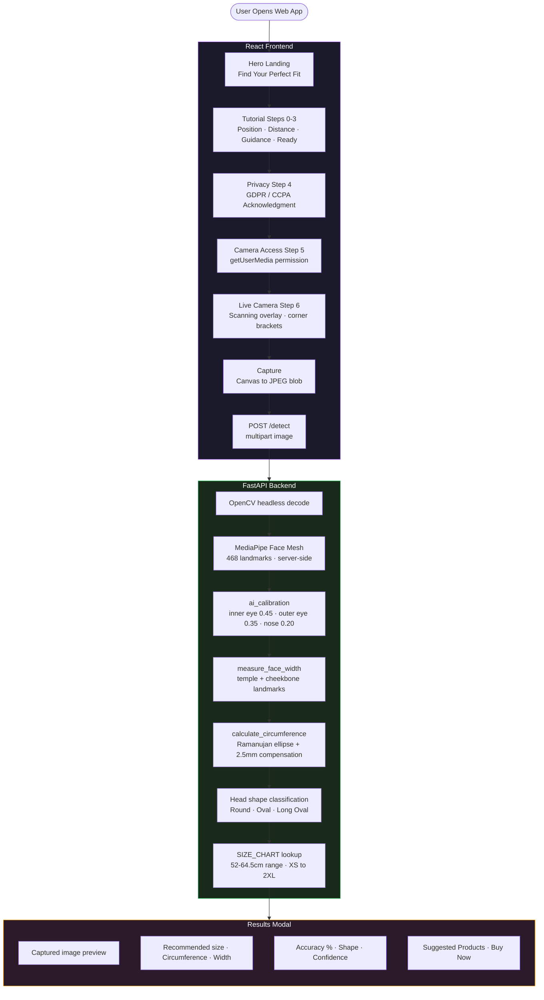

<!-- ████████████████████████████████  HEADER  ████████████████████████████████ -->

<div align="center">


</div>

<!-- ████████████████████████████████  TYPING  ████████████████████████████████ -->

<div align="center">

[](https://git.io/typing-svg)

</div>

<br/>

<!-- ████████████████████████████████  BADGES  ████████████████████████████████ -->

<div align="center">

[](https://react.dev)
[](https://vitejs.dev)
[](https://fastapi.tiangolo.com)
[](https://mediapipe.dev)
[](https://tailwindcss.com)
[](https://python.org)
[](https://helmet-sense-8v17.vercel.app/)

</div>

<br/>

---

<!-- ████████████████████████████████  ABOUT  ████████████████████████████████ -->

## 🧠 What This Project Does

```python
class HelmetSense:
    def __init__(self):
        self.author     = "Krishna Nagpal"
        self.purpose    = "AI helmet/hat sizing — no measuring tape, no reference object"
        self.input      = "Single front-facing photo via browser webcam"
        self.output     = "Head circumference · width · depth · shape · recommended size"
        self.standard   = "ISO 7250-1:2017 (International anthropometric standards)"
        self.deployment = "Vercel (frontend) + Render (backend) · Shopify-integrable"
        self.accuracy   = "±5mm typical with good lighting and frontal positioning"

    @property
    def measurement_pipeline(self):
        return {
            "calibration"   : "3 facial rulers (inner eye, outer eye, nose width) → px/mm scale",
            "face_width"    : "Temple + cheekbone landmarks (MediaPipe 234/127, 454/356)",
            "compensation"  : "Frontal photos show 93% of head width — divide by 0.93",
            "depth"         : "Head depth = width × 1.28  (ISO 7250-1:2017)",
            "circumference" : "Ramanujan ellipse approx + 2.5mm hair compensation",
            "size_lookup"   : "6-size chart 52–64.5cm · X-Small to 2X-Large + hat sizes",
        }
```

> Upload a photo — get your helmet size. No measuring tape. No calibration object. Just **468 MediaPipe face landmarks** running server-side, mapped to ISO anthropometric standards.

---

<!-- ████████████████████████████████  LIVE  ████████████████████████████████ -->

## 🌐 Live Deployment

<div align="center">

| Service | URL |
|:---|:---|
| 🟢 Frontend (Vercel) | [helmet-sense-8v17.vercel.app](https://helmet-sense-8v17.vercel.app/) |
| ⚙️ Backend (Render) | Set as `VITE_API_BASE_URL` in Vercel env |
| 📦 GitHub | [github.com/Dazuka-n/HelmetSense](https://github.com/Dazuka-n/HelmetSense.git) |

</div>

---

<!-- ████████████████████████████████  PIPELINE  ████████████████████████████████ -->

## 🔁 End-to-End Pipeline



---

<!-- ████████████████████████████████  MEASUREMENT  ████████████████████████████████ -->

## 📐 How the Measurement Works

### Step 1 — AI Multi-Point Calibration (no reference object)

<div align="center">

| Facial Feature | Known Distance | Weight |
|:---|:---:|:---:|
| Inner-eye distance | 31.5 mm | 0.45 |
| Outer-eye distance | 93 mm | 0.35 |
| Nose width | 35 mm | 0.20 |

</div>

### Step 2 — Face Width
Temple-to-temple via MediaPipe landmarks `234`/`127` (left) · `454`/`356` (right)

### Step 3 — Head Circumference
```
full_head_width = face_width ÷ 0.93       # frontal photos show ~93% of head width
depth           = full_head_width × 1.28   # ISO 7250-1:2017
circumference   = Ramanujan ellipse + 2.5mm hair/skin
```

### Step 4 — Size Chart

<div align="center">

| Size | Hat Size | Circumference |
|:---:|:---:|:---:|
| X-Small | 6 5/8 – 6 3/4 | 52.0 – 54.5 cm |
| Small | 6 7/8 – 7 | 54.5 – 56.5 cm |
| Medium | 7 1/8 – 7 1/4 | 56.5 – 58.5 cm |
| Large | 7 3/8 – 7 1/2 | 58.5 – 60.5 cm |
| X-Large | 7 5/8 – 7 3/4 | 60.5 – 62.5 cm |
| 2X-Large | 7 7/8 – 8 | 62.5 – 64.5 cm |

</div>

> Reference: **ISO 7250-1:2017** · Accuracy: **±5mm typical** with good lighting.

---

<!-- ████████████████████████████████  API  ████████████████████████████████ -->

## 🔗 API Endpoints

<div align="center">

| Method | Endpoint | Description |
|:---:|:---|:---|
| `GET` | `/` | Health check — returns status, version, features |
| `GET` | `/size-chart` | Full size chart (6 sizes, X-Small to 2X-Large) |
| `POST` | `/detect` | Multipart image → head measurements + size recommendation |

</div>

**POST `/detect` Response:**

```json
{
  "success": true,
  "measurements": {
    "face_width_mm": 142.3,
    "head_width_mm": 153.0,
    "head_depth_mm": 195.8,
    "circumference_cm": 57.2,
    "head_shape": "Average"
  },
  "size_recommendation": {
    "recommended_size": "Medium",
    "hat_size": "7 1/8 - 7 1/4",
    "fit_description": "Excellent fit",
    "accuracy": "96%"
  },
  "confidence": "high",
  "calibration_info": {
    "method": "AI Multi-Point Calibration",
    "accuracy": "±5mm typical"
  }
}
```

---

<!-- ████████████████████████████████  TECH  ████████████████████████████████ -->

## 🛠️ Tech Stack

<div align="center">

[](.)

### Frontend — `FaceDetection-1/`

| Library | Version | Role |
|:---|:---:|:---|
| React | 19 | UI framework |
| Vite + SWC | 7 | Build tool — fast HMR |
| Tailwind CSS | v4 | Styling |
| Browser MediaDevices API | — | Live webcam capture |
| `<canvas>` | — | Frame capture → JPEG blob |
| React.lazy + Suspense | — | Lazy-loaded hero UI |

### Backend — `python-backend-1/`

| Library | Role |
|:---|:---|
| FastAPI + Uvicorn | REST API server |
| `opencv-python-headless` | Image decoding — no GUI deps, server-safe |
| MediaPipe Face Mesh | 468 landmarks · `refine_landmarks=True` · server-side |
| NumPy | Vector math for measurements |
| python-multipart | Multipart image upload parsing |

</div>

---

<!-- ████████████████████████████████  STRUCTURE  ████████████████████████████████ -->

## 🗂️ Repository Structure

```
HelmetSense/
├── FaceDetection-1/                     ← React + Vite frontend → Vercel
│   ├── src/
│   │   ├── App.jsx                      ← Lazy-loads HeroPageUI
│   │   ├── pages/heroLogic.jsx          ← useHeroPageLogic — all state/camera/capture
│   │   └── components/
│   │       └── hero-dasboard-ui/
│   │           ├── heroUi.jsx           ← Main UI — 12 sub-components
│   │           ├── resultmodeluI.jsx    ← Results modal
│   │           └── service/apiService.js
│   ├── package.json                     ← (named: shopify-helmet-project)
│   └── vite.config.js
│
└── python-backend-1/                    ← FastAPI + MediaPipe backend → Render
    ├── app/
    │   ├── main.py                      ← ~1470 lines · HeadMeasurementSystem
    │   └── head_pose.py                 ← Legacy (commented out)
    ├── requirements.txt
    └── .python-version                  ← 3.11.12
```

---

<!-- ████████████████████████████████  ENV  ████████████████████████████████ -->

## ⚙️ Environment Variables

<div align="center">

| Variable | Where | Purpose |
|:---|:---:|:---|
| `VITE_API_BASE_URL` | Vercel (frontend) | Render backend URL |
| `PYTHON_VERSION` | Render (backend) | Pin to `3.11.12` for MediaPipe compatibility |
| `ALLOWED_ORIGINS` | Render (backend) | CORS origins — defaults to `*` |
| `PORT` | Render (backend) | Server port — defaults to `8000` |

</div>

---

<!-- ████████████████████████████████  GETTING STARTED  ████████████████████████████████ -->

## 🚀 Getting Started

### 1️⃣ Backend

```bash
cd python-backend-1
pip install -r requirements.txt
uvicorn app.main:app --host 0.0.0.0 --port 8000
```

### 2️⃣ Frontend

```bash
cd FaceDetection-1
npm install
npm run dev     # → http://localhost:5173
                # defaults to http://localhost:8000 when VITE_API_BASE_URL is not set
```

---

<!-- ████████████████████████████████  KEY DECISIONS  ████████████████████████████████ -->

## 🎯 Key Design Decisions

<div align="center">

| Decision | Reason |
|:---|:---|
| No physical reference object | Pure AI calibration using known anthropometric landmark distances |
| No routing library | Single-page modal wizard — `currentStep` state navigation only |
| All logic in `useHeroPageLogic` | Clean separation of logic from UI components |
| MediaPipe runs server-side | Better accuracy than in-browser WASM execution |
| `opencv-python-headless` | No GUI dependencies — safe for Render / server deployment |

</div>

---

<!-- ████████████████████████████████  KNOWN ISSUES  ████████████████████████████████ -->

## ⚠️ Known Issues

<div align="center">

| Issue | Location | Fix |
|:---|:---|:---|
| API response key mismatch — results show "N/A" | `heroLogic.jsx:269` | Map `size_recommendation.recommended_size` → `recommendedSize` |
| CORS open to `*` | `main.py` | Tighten to specific origins before prod |
| `head_pose.py` dead code | `python-backend-1/app/` | Remove or archive |
| Folder name typo | `hero-dasboard-ui/` | Rename to `hero-dashboard-ui/` + update imports |

</div>

---

<!-- ████████████████████████████████  ROADMAP  ████████████████████████████████ -->

## 📌 Roadmap

- [ ] Fix API response key mapping — results modal currently shows "N/A"
- [ ] Live Shopify embed integration
- [ ] Multi-photo averaging for improved accuracy
- [ ] Mobile rear-facing camera support
- [ ] Tighten CORS for production

---

<!-- ████████████████████████████████  FOOTER  ████████████████████████████████ -->

<div align="center">


**Krishna Nagpal** · HelmetSense · AI-Powered Sizing

[](https://helmet-sense-8v17.vercel.app/)
[](https://github.com/Dazuka-n/HelmetSense.git)
[](https://mediapipe.dev)

> *"No measuring tape. No reference card. Just your face."*

⭐ Star this repo if it was useful!

</div>
