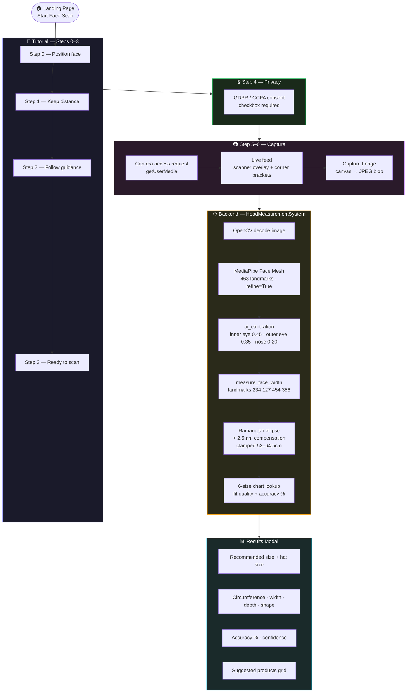

<!-- ████████████████████████████████  HEADER  ████████████████████████████████ -->


<!-- ████████████████████████████████  TYPING  ████████████████████████████████ -->

<div align="center">

[](https://git.io/typing-svg)

</div>

<br/>

<!-- ████████████████████████████████  BADGES  ████████████████████████████████ -->

<div align="center">

[](https://react.dev)
[](https://vitejs.dev)
[](https://fastapi.tiangolo.com)
[](https://mediapipe.dev)
[](https://python.org)
[](https://helmet-sense-8v17.vercel.app/)
[](https://render.com)

</div>

<br/>

<!-- ████████████████████████████████  LIVE  ████████████████████████████████ -->

<div align="center">

[](https://helmet-sense-8v17.vercel.app/)
[](https://github.com/Dazuka-n/HelmetSense)

</div>

<br/>

---

<!-- ████████████████████████████████  ABOUT  ████████████████████████████████ -->

## 🧠 What This Project Does

```python
class HelmetSense:
    def __init__(self):
        self.author     = "Krishna Nagpal"
        self.purpose    = "AI helmet/hat sizing — no tape measure, no physical markers"
        self.input      = "Single front-facing photo via browser webcam"
        self.output     = "Head circumference · width · depth · shape · recommended size"
        self.standard   = "ISO 7250-1:2017 (International anthropometric standards)"
        self.accuracy   = "±5mm typical with good lighting and frontal positioning"
        self.deployment = "Vercel (frontend) + Render (backend) · Shopify-integrable"

    @property
    def algorithm(self):
        return {
            "step_1" : "Multi-point calibration — 3 facial rulers → weighted px/mm scale",
            "step_2" : "Face width — temple landmarks 234/127 + 454/356 (MediaPipe)",
            "step_3" : "Anthropometric compensation — frontal photo = 93% of head width",
            "step_4" : "Depth estimation — head depth ≈ width × 1.28 (ISO standard)",
            "step_5" : "Circumference — Ramanujan ellipse + 2.5mm hair/skin offset",
            "step_6" : "Size mapping — 6-size chart (52cm – 64.5cm range)",
        }
```

> Buying helmets online leads to high return rates because buyers don't know their head size. HelmetSense fixes this: one browser photo → instant size recommendation, ready to drop into any e-commerce checkout flow.

---

<!-- ████████████████████████████████  USER FLOW  ████████████████████████████████ -->

## 🔁 User Flow + Measurement Pipeline



---

<!-- ████████████████████████████████  ALGORITHM  ████████████████████████████████ -->

## 📐 Measurement Algorithm

### Calibration — No Reference Object

Three facial landmarks used as known-distance rulers → **weighted pixels-per-mm scale:**

<div align="center">

| Facial Feature | Known Distance | Weight |
|:---|:---:|:---:|
| Inner-eye distance | 31.5 mm | 0.45 |
| Outer-eye distance | 93 mm | 0.35 |
| Nose width | 35 mm | 0.20 |

</div>

### Circumference Formula

```
face_width        =  average of temple + cheekbone landmarks
full_head_width   =  face_width ÷ 0.93      (frontal photo compensation)
head_depth        =  full_head_width × 1.28  (ISO 7250-1:2017)
circumference     =  Ramanujan ellipse approximation
                  +  2.5 mm hair/skin offset
                     clamped to 52 – 64.5 cm
```

### Size Chart

<div align="center">

| Size | Hat Size | Circumference |
|:---:|:---:|:---:|
| X-Small | 6⅝ – 6¾ | 52.0 – 54.5 cm |
| Small | 6⅞ – 7 | 54.5 – 56.5 cm |
| Medium | 7⅛ – 7¼ | 56.5 – 58.5 cm |
| Large | 7⅜ – 7½ | 58.5 – 60.5 cm |
| X-Large | 7⅝ – 7¾ | 60.5 – 62.5 cm |
| 2X-Large | 7⅞ – 8 | 62.5 – 64.5 cm |

</div>

---

<!-- ████████████████████████████████  API  ████████████████████████████████ -->

## 🔗 API Endpoints

<div align="center">

| Method | Endpoint | Description |
|:---:|:---|:---|
| `GET` | `/` | Health check — status · version · features |
| `GET` | `/size-chart` | Full 6-size chart JSON |
| `POST` | `/detect` | Multipart image → head measurements + size recommendation |

</div>

**POST `/detect` Response:**

```json
{
  "success": true,
  "measurements": {
    "face_width_mm": 142.3,
    "head_width_mm": 153.0,
    "head_depth_mm": 195.8,
    "circumference_cm": 57.2,
    "head_shape": "Average"
  },
  "size_recommendation": {
    "recommended_size": "Medium",
    "hat_size": "7 1/8 - 7 1/4",
    "fit_description": "Excellent fit",
    "accuracy": "96%"
  },
  "confidence": "high",
  "calibration_info": {
    "method": "AI Multi-Point Calibration",
    "accuracy": "±5mm typical"
  }
}
```

---

<!-- ████████████████████████████████  TECH  ████████████████████████████████ -->

## 🛠️ Tech Stack

<div align="center">

[](.)

| Layer | Technology |
|:---|:---|
| **Frontend** | React 19 · Vite 7 · Tailwind CSS v4 |
| **Backend** | FastAPI + Uvicorn · Python 3.11.12 |
| **AI / CV** | MediaPipe Face Mesh (468 landmarks) · OpenCV headless |
| **Capture** | Browser `MediaDevices.getUserMedia` · `<canvas>` → JPEG blob |
| **Hosting** | Vercel (frontend) · Render (backend) |

</div>

---

<!-- ████████████████████████████████  STRUCTURE  ████████████████████████████████ -->

## 🗂️ Repository Structure

```
HelmetSense/
├── FaceDetection-1/                     ← React + Vite frontend
│   └── src/
│       ├── main.jsx                     ← Entry point
│       ├── App.jsx                      ← Lazy-loads HeroPageUI
│       ├── pages/heroLogic.jsx          ← All business logic (custom hook)
│       └── components/
│           ├── background/globalBackground.jsx
│           └── hero-dasboard-ui/
│               ├── heroUi.jsx           ← Main UI — 12 sub-components
│               ├── resultmodeluI.jsx    ← Results display modal
│               └── service/apiService.js ← API client → POST /detect
│
└── python-backend-1/                    ← FastAPI backend
    ├── app/
    │   ├── main.py                      ← ~1470 lines · HeadMeasurementSystem
    │   └── head_pose.py                 ← Legacy (commented out)
    ├── requirements.txt
    └── .python-version                  ← 3.11.12
```

---

<!-- ████████████████████████████████  ENV VARS  ████████████████████████████████ -->

## ⚙️ Environment Variables

<div align="center">

| Variable | Where | Purpose |
|:---|:---:|:---|
| `VITE_API_BASE_URL` | Vercel (frontend) | Backend URL — e.g. `https://xxx.onrender.com` |
| `PYTHON_VERSION` | Render (backend) | Pin to `3.11.12` for MediaPipe compatibility |
| `ALLOWED_ORIGINS` | Render (backend) | CORS origins — defaults to `*` |
| `PORT` | Render (backend) | Server port — defaults to `8000` |

</div>

---

<!-- ████████████████████████████████  GETTING STARTED  ████████████████████████████████ -->

## 🚀 Getting Started

### 1️⃣ Backend

```bash
cd python-backend-1
pip install -r requirements.txt
uvicorn app.main:app --host 0.0.0.0 --port 8000
```

### 2️⃣ Frontend

```bash
cd FaceDetection-1
npm install
npm run dev        # → http://localhost:5173
```

> Frontend defaults to `http://localhost:8000` when `VITE_API_BASE_URL` is not set.

### 3️⃣ Deploy

| Service | Config |
|:---|:---|
| **Vercel** | Set `VITE_API_BASE_URL` = your Render backend URL |
| **Render** | Set `PYTHON_VERSION=3.11.12` · start command: `uvicorn app.main:app --host 0.0.0.0 --port $PORT` |

---

<!-- ████████████████████████████████  DESIGN  ████████████████████████████████ -->

## 🎯 Key Design Decisions

<div align="center">

| Decision | Reason |
|:---|:---|
| No physical reference objects | Pure AI calibration using known anthropometric facial distances |
| No routing library | Single-page modal wizard — state-based step navigation only |
| All logic in one custom hook | `useHeroPageLogic` — clean separation of logic from UI |
| Server-side MediaPipe | Runs on backend (not browser) for accuracy — 468 landmarks |
| `opencv-python-headless` | No GUI dependencies — safe for Render/Docker deployment |
| Python 3.11.12 pinned | MediaPipe has strict Python version requirements |

</div>

---

<!-- ████████████████████████████████  FOOTER  ████████████████████████████████ -->

<div align="center">


**Krishna Nagpal** · HelmetSense · AI-Powered Sizing

[](https://helmet-sense-8v17.vercel.app/)
[](https://github.com/Dazuka-n/HelmetSense)
[](https://mediapipe.dev)

> *"No tape measure. No reference card. Just your face."*

⭐ Star this repo if it was useful!

</div>
